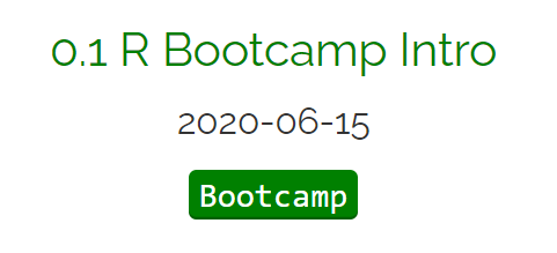

```{r setup, include=FALSE}
knitr::opts_chunk$set(echo = FALSE)
```


## Day 1 with R and Rstudio

&nbsp;

<center>

https://dsgarage.netlify.app/bootcamp/0.1-bootcamp-intro/

```{r, echo=FALSE, out.width="50%", fig.cap=""}

```

</center>

## What will you learn?

&nbsp;

- Install R and RStudio

- Practice of good, **reproducible** scripting

- Design vision of learning materials: Read the pages and type and run all code


## Tour of RStudio interface

<center>

```{r, echo=FALSE, out.width="90%", fig.cap=""}
knitr::include_graphics("img/0.1-rstudio.png")
```

</center>

## Reproducible script

<center>

```{r, echo=FALSE, out.width="90%", fig.cap=""}
knitr::include_graphics("img/script.png")
```

</center>

